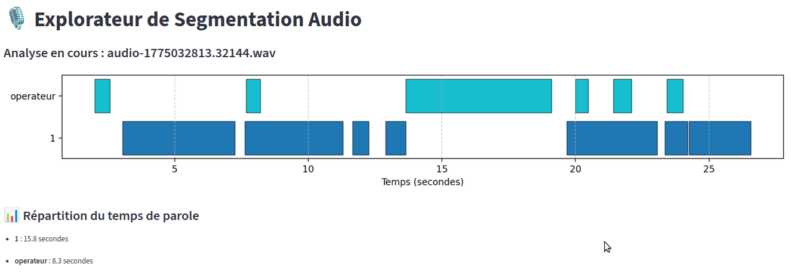
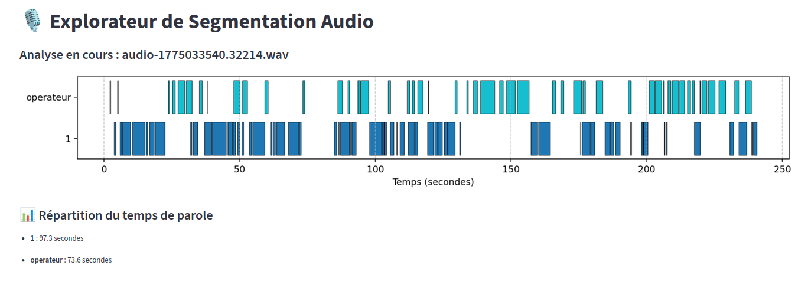
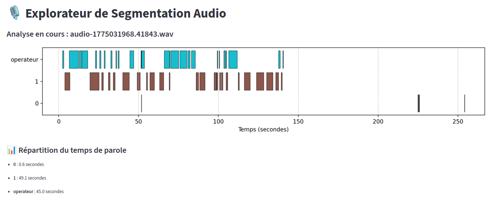
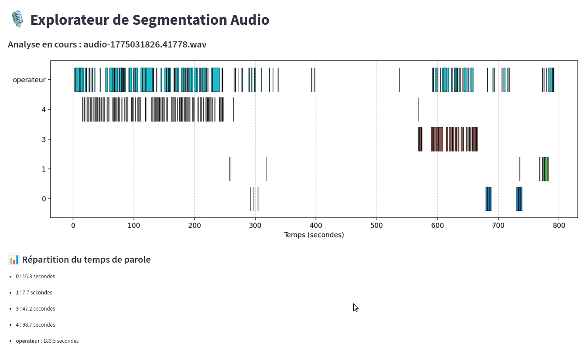
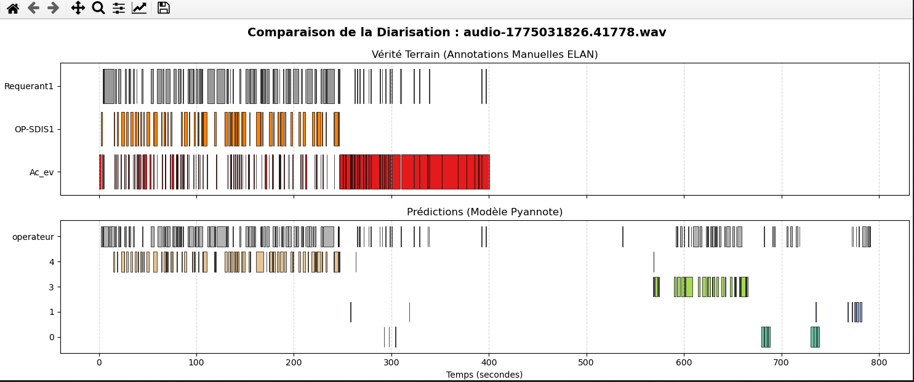
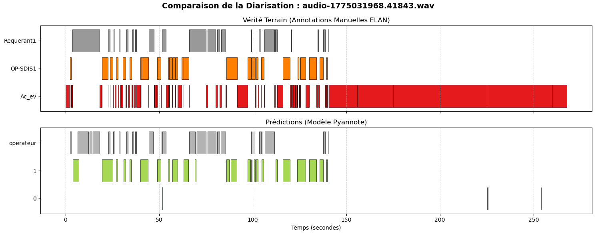
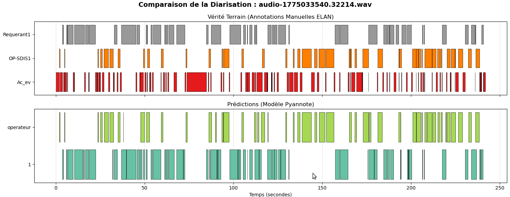

Travail à partir du fichier json issu de pyannote avec  116 fichiers audio wav étudiés
segmentation_audios_Nexsis.json

pip install streamlit matplotlib

Le script de l'application (app.py)
Créez un fichier nommé app.py (dans le même dossier que votre JSON)

Lancer l'application
Dans votre terminal, au lieu d'exécuter le script normalement avec python, lancez :
streamlit run app.py

Ce qui va se passer : Une page web va s'ouvrir automatiquement dans votre navigateur. 
Sur la gauche, vous aurez un menu déroulant listant vos 300+ fichiers. 
Dès que vous en sélectionnez un, le chronogramme et les temps de parole s'affichent instantanément, 
proprement, et sans inonder votre ordinateur de centaines d'images

Navigation
Choisissez un fichier (116 au total) :
audio-1775032813.32144.wav (exemple)

audio 3540

audio 1968

audio 1826

plusieurs modèles

comparaison visuelle : comparaison_diarisation.py

dans le script changer le nom des fichiers eaf et wav : ex audio-1775033540.32214

remarque sur audio 1968 inversion par pyannote operateur et requerant

comparaison métrique diarisation V1

audio 1826
==================================================
📊 RAPPORT D'ÉVALUATION CORRIGÉ (DER)
Évalué uniquement sur les 240.0 premières secondes.
==================================================
DER Global          : 22.06 % d'erreur au total
--------------------------------------------------
  - Omissions       : 4.53 %
  - Fausses Alertes : 14.38 %
  - Confusions      : 3.14 %
==================================================

audio 1968
==================================================
📊 RAPPORT D'ÉVALUATION CORRIGÉ (DER)
Évalué uniquement sur les 240.0 premières secondes.
==================================================
DER Global          : 19.49 % d'erreur au total
--------------------------------------------------
  - Omissions       : 9.95 %
  - Fausses Alertes : 4.18 %
  - Confusions      : 5.36 %
==================================================

audio 3540

==================================================
📊 RAPPORT D'ÉVALUATION CORRIGÉ (DER)
Évalué uniquement sur les 240.0 premières secondes.
==================================================
DER Global          : 18.60 % d'erreur au total
--------------------------------------------------
  - Omissions       : 7.24 %
  - Fausses Alertes : 10.71 %
  - Confusions      : 0.65 %
==================================================

autre gestion du json :

utilisation du json issu de pyanote pour découper les wav originaux en  wav complet par locuteur
pour augmenter le corpus de voix pour reconnaître qui parle 
Rq : les wav originaux ne sont pas des wav, le script avec Pydud pour traduire les fichiers en vrai wav
nom du script : decoupage_audio.py
renseigné le nom du fichier à extraire a la fin du script
création automatique d’un dossier « locuteurs_extraits » récupérant les fichiers concaténés opérateurs , voix 1 ou 2 et même 0 , 3,4

